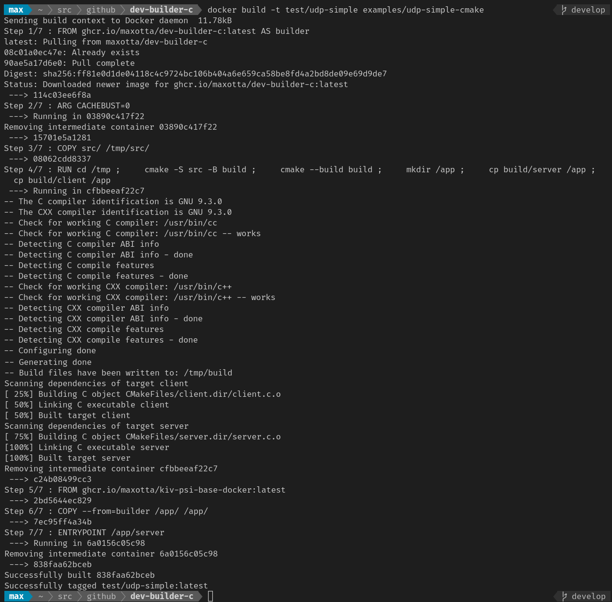
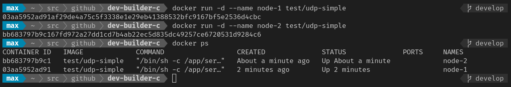
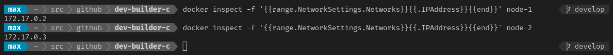
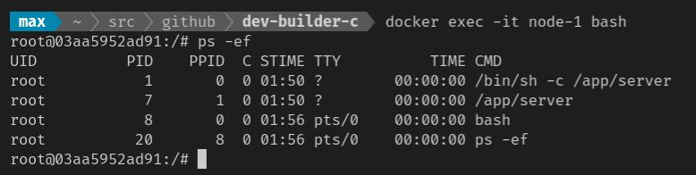
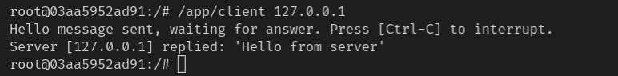
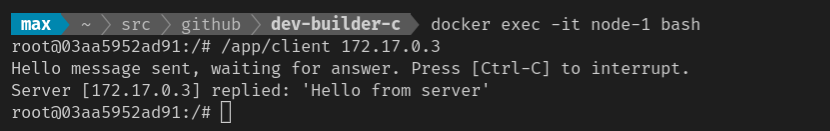
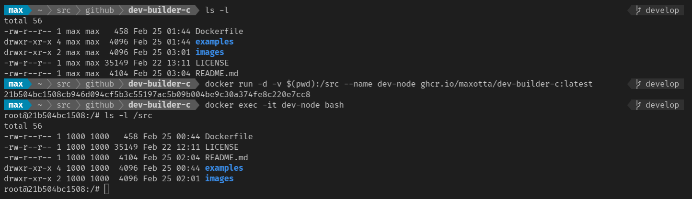
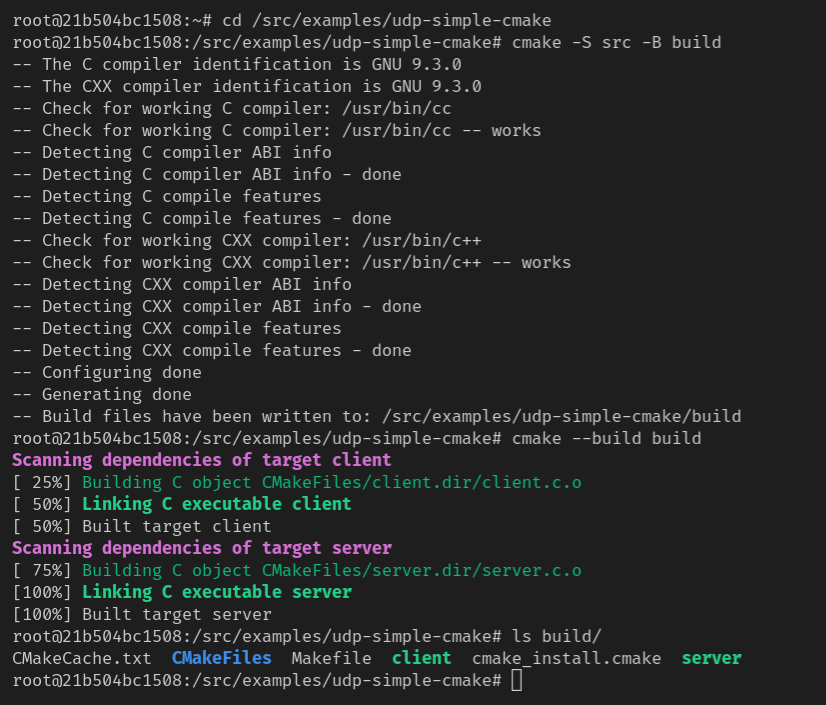
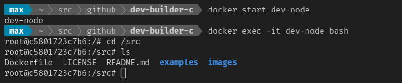

# Docker image `dev-builder-c`

## Introduction

This Docker image is intended for use in multi-stage Docker image builds.
The basic idea behind multi-stage builds is, that you build your app in a Docker container instead of your local machine. This has some advantages that developers like:
* your development environment is setup automatically - just using the `docker pull` and `docker run` commands
* it's platform independent - you can run it on any platform Docker is available for
* it doesn't mess up your machine - you can easily dispose the whole thing when you're done with the `docker stop` and `docker rm` commands

## About this container image

The main purpose of this container image is to be used as a **builder** in a Docker multi-stage build. It is based on the official [Ubuntu (20.04/focal) Docker image](https://hub.docker.com/_/ubuntu) contains essential tools for building C apps:
* The GNU C, C++ Compiler
* The `make` and `cmake` build utilities
* The Git VCS
* The `curl` utility for downloading stuff from the Internet

For the complete list the essential build tools look at the [`build-essential`](https://packages.ubuntu.com/focal/build-essential) package.


## Docker multi-stage builds explained

The main idea of a [Docker multi-stage build](https://docs.docker.com/develop/develop-images/multistage-build/) is to use a separate ***"Stage 1"*** container for building the application and then add the built application to the target ***"Stage 2"*** container. The main benefits of this approach are:
* automated setup of the build environment
* smaller footprint of the taget container image

The following diagram shows, how the multi-stage build works for the examples provided with this image:


## How to use this image

There are two examples of how to use the `dev-builder-c` image in a multi-stage image build provided in this repo:
* [`udp-simple`](examples/udp-simple) - a simple UDP server/client example set to build with the `make` utility
* [`udp-simple-cmake`](examples/udp-simple-cmake) - a simple UDP server/client example set to build with the `cmake` utility

Let's get started with the `udp-simple-cmake` example. Open a terminal window and run the following command:
```
docker build -t test/udp-simple examples/udp-simple-cmake
```


Now you have built a container image with the simple UDP example client and server, which can be found in the `/app` directory.
Let's start 2 container based on this image:
```
docker run -d --name node-1 test/udp-simple
docker run -d --name node-2 test/udp-simple
```


We will need to know the IP addresses of both containers, so we get them with the following commands:
```
docker inspect -f '{{range.NetworkSettings.Networks}}{{.IPAddress}}{{end}}' node-1
docker inspect -f '{{range.NetworkSettings.Networks}}{{.IPAddress}}{{end}}' node-2
```


In order to test the example app, we connect to the `node-1` container with the command:
```
docker exec -it node-1 bash
```
and look if the UDP server is really running:
```
ps -ef
```
The output should look something like this:



Now we are ready to the test the UDP client/server app. At first we try to reach the local UDP server:
```
/app/client 127.0.0.1
```


And also the UDP server running in the `node-2` container (use the IP address you've got previously with the `docker inspect` command for `node-2`):
```
/app/client 172.17.0.3
```


Now this is all folks and we can cleanup our workspace:
```
docker stop node-1 node-2
docker rm node-1 node-2
```
## Using the image for application development

The `dev-builder-c` image can be also used as it is for application development. The only difference to the previous use in a multi-stage build is, that you don't copy the source code into the container using the `COPY` instruction, but you tell Docker to mount your local directory containing the source code into the container. This is done by [using volumes](https://docs.docker.com/storage/volumes/) or more precisely [bind mounts](https://docs.docker.com/storage/bind-mounts/). You pass the local directory path and container mount point using the `-v` option to the `docker run` command. The following examples show how to mount the current directory (assuming it's the root of this cloned repository) into the container at `/src`.
For Windows `cmd` use:
```
docker run -d -v %cd%:/src --name dev-node ghcr.io/maxotta/dev-builder-c:latest
```
for Windows *PowerShell* use:
```
docker run -d -v $(PWD):/src --name dev-node ghcr.io/maxotta/dev-builder-c:latest
```
and for Linux, Mac OS or other Unix like systems use:
```
docker run -d -v $(pwd):/src --name dev-node ghcr.io/maxotta/dev-builder-c:latest
```
Then simply connect to the running `dev-node` container with
```
docker exec -it dev-node bash
```

and try to build the example app by yourself:
```
cd /src/examples/udp-simple-cmake
cmake -S src -B build
cmake --build build
```


Try also to make some changes to the source code (of course on the local machine outside the container) and rebuild the app.

When you're finished, you can stop the container
```
docker stop dev-node
```
and resume your work later by starting the container again and connect to it
```
docker start dev-node
docker exec -it dev-node bash
```

